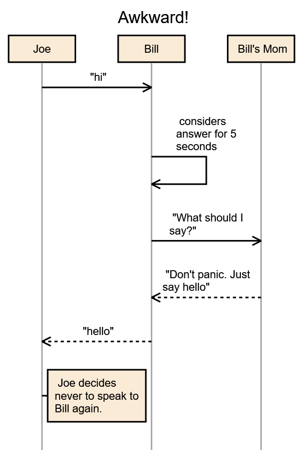

# SequenceDiagrams_JavaFX

I was inspired by web-based tools like [this one][1], but
the environment were I work forces us to use pre-SVG browsers.
So, I whipped up a WPF app for it, [which is on github as well][2]. 
Now, I'm making a port to JavaFX!

Basically, you type in the panel on the left, and every time you
stop typing, it renders an updated diagram.  You can then 
save your completed diagram as a PNG. 


Grammar
-------

The grammar is very simple (it's a regular language, line-by-line).


  * `Title : string` Defines a title for the diagram.
  * `ID [ : string ]`  Declares an actor, and optionally refines a display-name for it.
  * `ID to ( ID|self ) [ dashed ] [ : string ]` Defines an arrow line from the first ID to 
the seond ID (or to itself if the second actor is `self`).  If the `dashed` token is provided, 
the line will be dashed.  If given, a title string is added to the line.
  * `Note ID : string` Adds a note to the actor with the given string.

That, along with a comment token, `#`, is the entire grammar.  The actors in the diagram
do not have to be pre-declared; if you mention a new name you get a new actor.  That said, the easiest
way to force the ordering from left to right is to declare the actors in the order you want.


Example
--------

Here's an example that covers most of the features, and shows that you can provide
information like the title and display names just about anywhere... even at the end. 


```
Joe to Bill : "hi"
Bill to self: considers answer for 5 seconds
Bill to bm: "What should I say?"
bm to Bill dashed: "Don't panic. Just say hello"
Bill to Joe dashed: "hello"
note Joe: Joe decides never to speak to Bill again.

bm: Bill's Mom
Title: Awkward!
``` 

...gets you:




[1]: https://github.com/bramp/js-sequence-diagrams
[2]: https://github.com/waywardcoder/SequenceDiagrams_WPF
